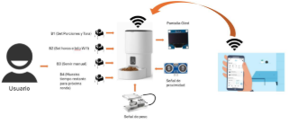
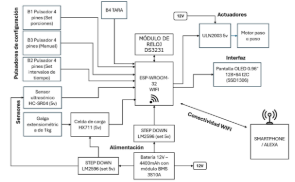
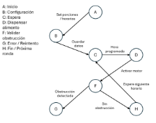
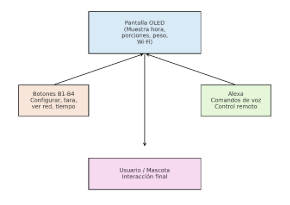
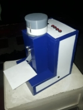
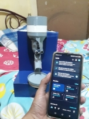

# __Dispensador Automático de Alimento para Mascotas con Control Remoto vía Wi-Fi y Alexa__

David Gonzalez Yaguachi – <dagoyagu@espol.edu.ec> 

Abraham Jaramillo Quinde – <abdajara@espol.edu.ec> 

## __1. INTRODUCCIÓN__

La creciente carga laboral y el estilo de vida acelerado dificultan el cuidado constante de las mascotas. Como solución, se propone el diseño de un dispensador de alimento automatizado, configurable en porciones y horarios, con conectividad Wi-Fi y control remoto mediante asistentes virtuales como Alexa. El sistema busca garantizar el bienestar de las mascotas en ausencia de sus dueños. 

## __2. OBJETIVOS__

*Objetivo General*

Desarrollar un alimentador automatizado que asegure el suministro adecuado de alimento en horarios programados.

*Objetivos Específicos*
- Desarrollar software modular en C++.
- Implementar interfaz de usuario en pantalla OLED.
- Validar la fiabilidad del sistema ante escenarios críticos.

## __3. ALCANCES Y LIMITACIONES__

El prototipo permite configurar porciones en gramos, definir intervalos de tiempo, realizar dispensación manual, verificar conectividad Wi-Fi y usar funciones de tara/calibración. Entre las limitaciones se encuentran:

- No cuenta con app móvil propia (solo integración con Alexa).
- No incluye cámaras ni audio para interactuar con la mascota.
- No adapta dietas según especie o edad.
- No es hermético frente a robos de alimento o plagas.

## __4. DIAGRAMA DE CONTEXTO__

Fig. 1 Diagrama de contexto 

El diagrama de contexto muestra al dispensador automático como sistema central, que recibe entradas del usuario mediante botones y conexión Wi-Fi/Alexa, y genera salidas hacia la mascota mediante la dispensación de alimento y la visualización de datos en la pantalla OLED.

## __5. DIAGRAMA DE BLOQUES DEL DISEÑO__

Fig. 2 Diagrama de bloques

El diagrama de bloques del proyecto representa la estructura interna del dispensador, donde la ESP32 actúa como unidad central conectada a los sensores de peso, pantalla OLED, botones físicos, motor de dispensación y al módulo RTC para mantener los horarios, además de la conectividad Wi-Fi/Alexa para el control remoto.

## __6. DIAGRAMA DE SOFTWARE O MÁQUINA DE ESTADOS__

Fig. 3 Máquina de estado

El sistema inicia en el estado de **configuración**, donde el usuario define las porciones y los horarios. Luego pasa a **espera,** guardando los datos hasta que llegue la hora programada. En ese momento se activa la función de **dispensar alimento**, lo que da paso a la **validación de obstrucción**. Si no se detecta ningún problema, el proceso concluye en **fin/próxima ronda** y regresa a espera. En caso de bloqueo, el sistema entra en **error/reintento**, intentando hasta cinco veces antes de cancelar la acción. Finalmente, tras una dispensación exitosa, el dispositivo permanece en espera hasta la siguiente programación.

## __7. DISEÑO DE INTERFACES__

   

Fig. 4 Diagrama de diseño de interfaces

En el diseño de interfaces del sistema se consideran varios elementos clave. La pantalla OLED cumple la función de mostrar al usuario la información esencial, como la hora, el peso del plato, las porciones configuradas y el estado de la red. Los botones físicos (B1–B4) permiten realizar acciones específicas, tales como configurar las porciones de alimento, ejecutar la función de tara en la balanza y consultar datos relevantes del dispositivo. 

Adicionalmente, se integra Alexa como interfaz de voz, lo que facilita el control remoto mediante comandos simples y accesibles desde cualquier red. Finalmente, el usuario y la mascota representan los receptores finales del proceso, ya que interactúan con el dispositivo y reciben directamente el beneficio de la dispensación automática de alimento.

## __8. ALTERNATIVAS DE DISEÑO__

   Se emplea una ESP32 como controlador principal, junto con:

- Sensores de peso para medir las porciones.
- Pantalla OLED para visualización de datos.
- Botones físicos para interacción.
- Mecanismo de aspas movido por motor paso a paso para dispensar alimento.
- Reloj RTC para mantener horarios aun sin energía.

El diseño descartó opciones como tornillo sin fin, pantallas táctiles o sensores adicionales (cámaras, IR) debido a costos, complejidad y consumo energético.

## __9. CONECTIVIDAD Y CONTROL__

   El dispositivo se conecta a Wi-Fi y puede ser operado mediante comandos de voz con Alexa, lo que permite control remoto desde cualquier red. El usuario también puede consultar en pantalla la red actual, dirección IP y tiempo restante para la siguiente dispensación.

## __10. PLAN DE PRUEBA Y VALIDACIÓN__

   El sistema fue probado en distintos casos:

TABLA 1 
PROBLEMAS Y SOLUCIONES DEL DISEÑO

|**Obstrucciones**|El sensor ultrasónico evita atascos cancelando la dispensación.|
| :- | :- |
|**Mascota frente al dispensador**|Retrasa y reintenta hasta 5 veces antes de cancelar.|
|**Exceso de alimento en bandeja**|No se dispensa más.|
|**Corte eléctrico**|El RTC conserva la hora; al regresar la energía, dispensa la ración pendiente.|
|**Cambio de red Wi-Fi**|Permite reconfiguración sencilla.|
|**Tara de bandeja**|Botón B1 elimina peso extra.|

## __11. CONSIDERACIONES ÉTICAS__

Aunque el sistema asegura la alimentación, puede disminuir la interacción entre dueño y mascota, lo que afecta el vínculo emocional. Además, al usar solo croquetas, existe riesgo de efectos en la salud renal si no se acompaña de agua o dieta variada. El dispositivo debe entenderse como apoyo y no sustituto del cuidado humano.

## __12. CONCLUSIONES__

El proyecto demuestra la viabilidad de un alimentador automático inteligente, económico y escalable. Su simplicidad mecánica, integración con Alexa y pruebas de validación lo convierten en una solución práctica para dueños ocupados. Futuras versiones podrían incluir una app móvil, mayor hermeticidad y sensores adicionales para optimizar la experiencia.

## __13. ANEXOS__

Fig. 5 Proyecto culminado

Fig. 6 Conexión con Alexa

